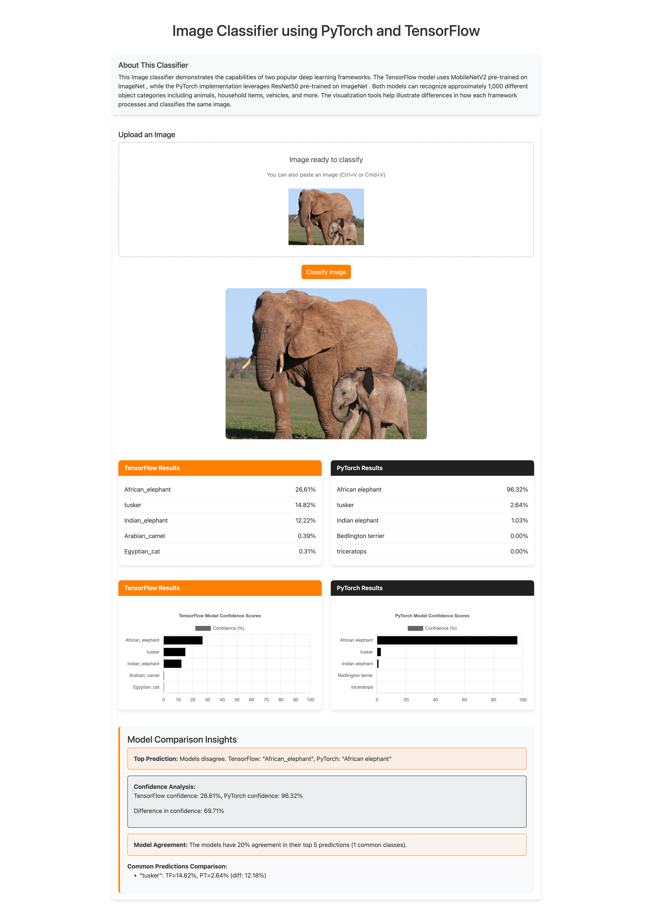

# Image Classifier



## Overview

This image classifier web application showcases the capabilities of two leading deep learning frameworks working side-by-side on the same task. By leveraging both TensorFlow and PyTorch, users can upload a single image and instantly compare how different model architectures and frameworks approach the same classification problem.

The TensorFlow implementation utilizes MobileNetV2, a lightweight and efficient model optimized for mobile and edge devices, pre-trained on the extensive ImageNet dataset. In parallel, the PyTorch classifier employs ResNet50, a deeper residual network architecture known for its accuracy in image recognition tasks, also pre-trained on ImageNet.

Both models can identify approximately 1,000 distinct object categories spanning everyday items, animals, vehicles, food, landscapes, and more. The application goes beyond simple classification by providing interactive visualizations that highlight the similarities and differences in confidence scores, prediction rankings, and overall classification approach between the two frameworks.

This tool serves as both an educational resource for understanding different deep learning implementations and a practical demonstration of how the same neural network task can be accomplished through different technical pathways, often with subtly different results.

## Setup Instructions

### Prerequisites
- Python 3.7 or higher
- pip (Python package installer)

### Installation

1. Clone the repository:
```bash
git clone https://github.com/AhmerMH/image-classifier.git
cd image-classifier
```

2. Create a virtual environment (recommended):
```bash
python -m venv venv
source venv/bin/activate  # On Windows: venv\Scripts\activate
```

3. Install dependencies:
```bash
pip install flask tensorflow torch torchvision pillow numpy
```

### Running the Application

1. Start the Flask application:
```bash
python app.py
```

2. Open your web browser and navigate to:
```
http://127.0.0.1:5000
```

3. Upload an image using the interface (drag-and-drop, file selection, or paste from clipboard).

4. View the comparison results from both frameworks along with detailed visualizations.

## Dependencies
- Flask: Web application framework
- TensorFlow: Deep learning framework for MobileNetV2 model
- PyTorch: Deep learning framework for ResNet50 model
- torchvision: Computer vision utilities for PyTorch
- Pillow: Image processing library
- NumPy: Numerical computing library
- Chart.js: JavaScript library for creating visualizations (loaded via CDN)
